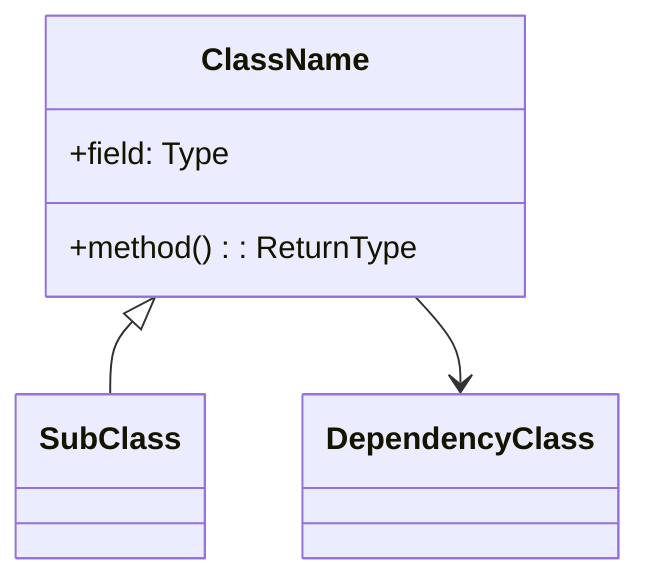
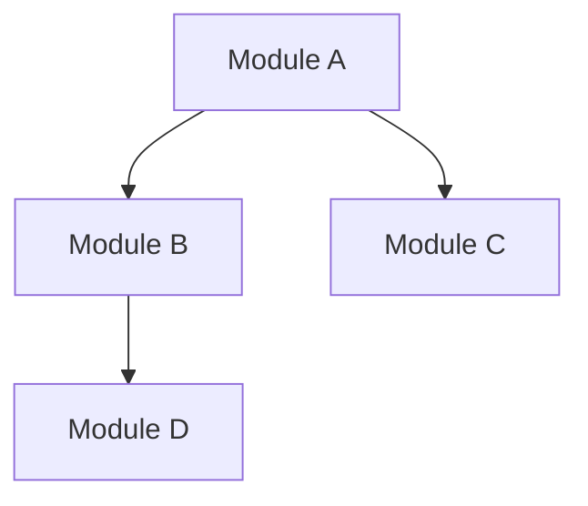
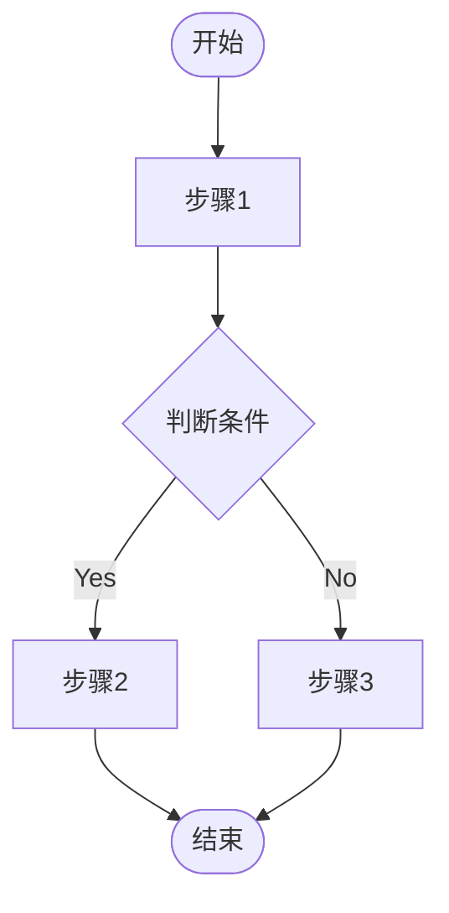
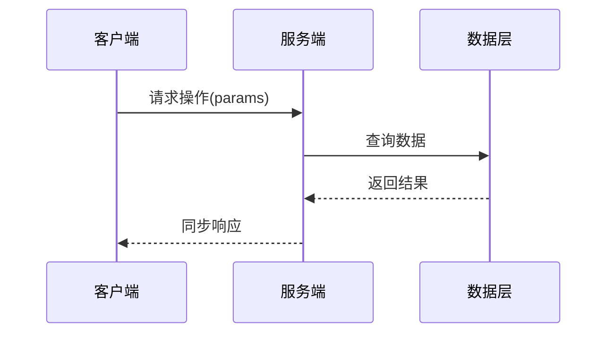
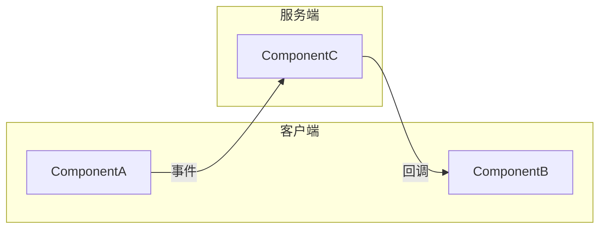
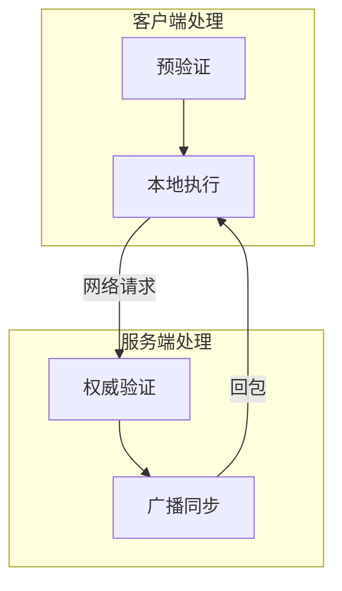
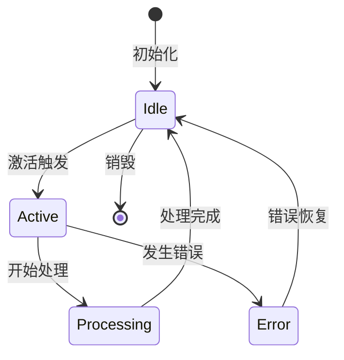

# {TOPIC}

> **归档日期**: {DATE}
> **归档版本**: {VERSION}
> **相关 Git 提交**: {COMMITS}

---

## 1. 概要需求描述

> 本节基于 FR 文档提炼，简要说明本次任务的背景、目标与核心需求。

### 1.1 背景

{BACKGROUND}

### 1.2 目标

{GOALS}

### 1.3 核心需求

{REQUIREMENTS}

---

## 2. 涉及系统

> 列出本次任务涉及的所有系统模块，说明各系统的职责边界。

| 系统 / 模块 | 层级 | 职责说明 |
|------------|------|---------|
| {SYSTEM_1} | Client / Server / Common | {RESPONSIBILITY_1} |

---

## 3. 功能操作流程

> 描述从玩家视角出发的正常游戏流程，按步骤列出核心操作。

### 3.1 {FEATURE_NAME}

**前置条件：**
- {PRECONDITION}

**操作步骤：**

1. {STEP_1}
2. {STEP_2}
3. {STEP_3}

**结果：**
- {RESULT}

---

## 4. 系统架构图

### 4.1 类图

> 描述核心类的属性、方法及继承/实现关系。

### 4.2 类依赖关系图

> 描述模块/包之间的依赖关系。

### 4.3 流程图

> 描述核心功能的执行流程（决策分支、循环等）。

### 4.4 时序图

> 描述各模块/角色之间的交互顺序（适用于客户端-服务端通信等）。

### 4.5 数据流图

> 描述事件、数据等的流向，包含数据初始化、读取、请求、响应、写入等流程均需要独立的数据流。

---

## 5. 其他 UML 模型图

> 根据任务特点，按需补充以下图表类型。

### 5.1 组件图（可选）

> 描述系统组件的组织方式及对外接口。

### 5.2 活动图（可选）

> 描述并发流程或复杂业务逻辑的活动分配。

### 5.3 状态图（可选）

> 描述对象/实体的生命周期状态转换（如武器状态、玩家状态等）。

---

## 6. 关键实现说明

> 记录实现过程中的重要决策、特殊处理逻辑、性能优化点，或踩坑记录。

### 6.1 {IMPL_POINT_1}

{IMPL_DESCRIPTION_1}

### 6.2 已知限制 / 待优化项

- {KNOWN_ISSUE_1}

---

## 7. 归档文件索引

| 文件 | 类型 | 说明 |
|------|------|------|
| `{FR_DOC}` | FR 文档 | 功能需求说明 |
| `{PLAN_DOC}` | Plan 文档 | 实现计划 |
| `{TOPIC}.md` | 归档总结 | 本文件 |
