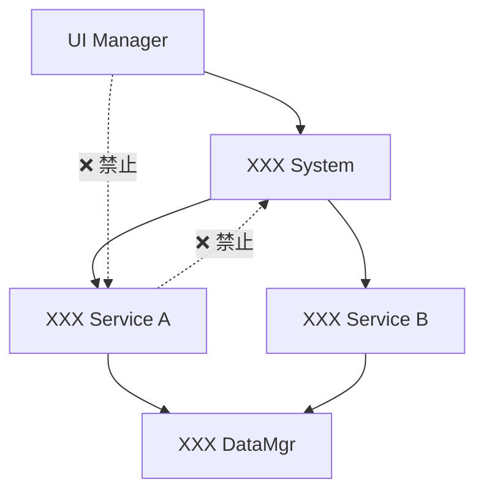

# Creating Instruction

为已完成的开发任务创建辅助性指导文档，确保后续相关开发能够正确理解和遵循本次任务建立的代码规范、架构设计和开发流程。

> **⚠️ 核心原则：指导文档必须基于实际代码实现。**
> 所有指导内容均须与代码保持一致，重点关注系统架构规范、开发流程和后续扩展要求。

> **⚠️ 定位说明：本技能生成的 instruction 是辅助性参考文档。**
> 它不具备独立驱动开发的能力，而是在开发过程中为开发者提供架构规范、模块职责、扩展指导等参考信息。开发者需结合具体需求，参照 instruction 中的规范进行开发。

## 前置检查（执行前必须确认）

生成指导文档前，**必须**向用户收集以下信息：

| 必要信息 | 说明 |
|---------|------|
| **topic** | 任务主题名称（用于文档标题和文件名） |
| **核心代码文件** | 本次任务涉及的主要代码文件路径列表 |
| **架构设计信息** | 系统架构、模块划分、依赖关系等设计信息 |
| **开发规范要求** | 本次任务建立或遵循的开发规范 |
| **目标文档名称** | 目标指导文档名称 |
| **依赖模块**（可选） | 本任务依赖的模块列表，需按类别提供（详见"依赖模块规范"） |
| **输出目录**（可选） | 默认为 `docs/<topic>/archive/instructions/` |

每次使用该技能时，必须检查上述信息，并进行确认。可选信息如果未提供也必须询问是否提供。

---

### 依赖模块规范

如果用户提供了依赖模块，必须按以下三大类进行分类整理，并在生成的 instruction 中以结构化格式明确记录。每个依赖都必须写得足够清晰，确保后续开发时能准确定位，不会找不到或找错。

#### 分类一：仓库内依赖

项目仓库内的其他模块或文件，给出相对于仓库根目录的路径。

格式要求：
```
- 模块名称: <名称>
  路径: <相对于仓库根目录的路径>
  说明: <该依赖提供的能力/接口>
```

#### 分类二：第三方依赖

非项目仓库、非语言内置的外部库/包/框架。

**状态 A - 需要下载安装**：
```
- 库名称: <完整的包名，如 npm 包名/pip 包名>
  版本要求: <版本号或版本范围>
  安装方式: <安装命令，如 npm install xxx / pip install xxx>
  说明: <用途>
```

**状态 B - 本地已有**：
```
- 库名称: <完整的包名>
  版本: <当前版本号>
  本地绝对路径: <完整的绝对路径>
  说明: <用途>
```

#### 分类三：内置依赖

语言/运行时自带的标准库模块。

**状态 A - 需要下载安装**（如需要特定运行时版本才有的内置模块）：
```
- 模块名称: <完整模块名>
  所需运行时版本: <如 Node.js >= 18.0 / Python >= 3.11>
  安装方式: <获取方式>
  说明: <用途>
```

**状态 B - 本地已有**：
```
- 模块名称: <完整模块名>
  本地绝对路径: <完整的绝对路径，如 C:\Python311\Lib\json>
  说明: <用途>
```

> **⚠️ 依赖记录原则**：宁可多写一行路径/版本信息，也不要让后续开发者猜测。每一个依赖都必须能通过文档中给出的信息直接定位到，不需要二次搜索。

---

## 指导文档生成工作流

### Step 1：分析代码实现

深入分析本次任务的代码实现，提取关键信息：

**1.1 系统架构分析**
- 识别涉及的模块层级（System、Service、Manager、DataMgr等）
- 分析模块间的依赖关系和调用链路
- 确定架构规范和设计模式

**1.2 代码结构分析**
- 识别新增/修改的类、接口、事件
- 分析类的继承关系和组合关系
- 确定工厂模式、注册机制等设计模式的使用

**1.3 业务流程分析**
- 分析数据流向和处理流程
- 识别事件触发机制和处理链路
- 确定客户端-服务端交互模式

**1.4 依赖模块分析**

如果用户提供了依赖模块信息，必须：
- 将每个依赖归类到"仓库内依赖"、"第三方依赖"或"内置依赖"
- 对于第三方依赖和内置依赖，确认状态为"需要下载"还是"本地已有"
- 对于"本地已有"的依赖，验证并记录完整绝对路径
- 对于"需要下载"的依赖，记录完整的安装命令和版本要求
- 检查依赖之间是否存在版本冲突或兼容性问题

### Step 2：提取开发规范

基于代码实现，提取并明确本次任务建立的开发规范：

**2.1 架构层级规范**
- System 层职责和使用规则
- Service 层职责和依赖规则
- Manager/DataMgr 层的分工界限
- 各层级间的调用约束

**2.2 模块扩展规范**
- 新增模块的注册要求
- 工厂方法的扩展规则
- 事件系统的扩展规范
- 接口定义和实现规范

**2.3 代码组织规范**
- 目录结构规范
- 文件命名规范
- 类和方法命名约定

### Step 3：生成指导文档

使用 `templates/instruction_template.md` 模板生成 `<topic>_instruction.md` 文档：

**3.1 填充模板占位符**

| 占位符 | 填充内容 |
|-------|---------|
| `{TOPIC}` | 任务主题名称 |
| `{DATE}` | 当前日期 |
| `{TRIGGER_CONDITION}` | 详细的触发条件描述 |
| `{SYSTEM_SPECS}` | 系统开发规范详细描述 |
| `{FILE_LIST}` | 涉及文件的完整列表 |
| `{ARCHITECTURE_RULES}` | 架构设计规则和约束 |
| `{EXTENSION_GUIDE}` | 后续扩展开发指导 |
| `{DEPENDENCIES}` | 依赖模块分类清单（如提供） |

**3.2 补充示例说明**

为复杂的规范提供具体的代码示例，如：
- Factory模式的使用示例
- 事件注册的代码示例  
- System-Service调用的示例
- 新增模块的标准实现示例

**3.3 生成"依赖模块清单"章节**

如果提供了依赖模块，在 instruction 中生成结构化的依赖清单：
- 按"仓库内依赖"、"第三方依赖"、"内置依赖"三大类组织
- 第三方依赖和内置依赖进一步按"需要下载"和"本地已有"区分
- 本地已有的依赖必须给出完整绝对路径
- 需要下载的依赖必须给出完整安装命令

### Step 4：验证指导文档

**4.1 完整性检查**
- [ ] 系统开发规范是否明确完整
- [ ] 文件列表是否包含所有相关文件
- [ ] 触发条件是否准确描述后续相关开发场景
- [ ] 架构规则是否与代码实现一致
- [ ] 依赖模块清单是否完整且分类正确（如提供）

**4.2 可操作性检查**  
- [ ] 后续开发者能否根据指导文档正确理解架构
- [ ] 扩展指导是否具体可执行
- [ ] 示例代码是否有助于理解规范
- [ ] 依赖模块是否能通过文档信息直接定位，无需二次搜索

## 输出规范

**文件命名**：`<topic>_instruction.md`
**输出路径**：`<archive_dir>/instructions/`

**文档结构要求**：
1. 以SKILL metadata格式开头，包含name和description
2. description中必须明确触发条件，确保后续相关开发能正确触发
3. 系统开发规范部分必须清楚、确定、正确
4. 必须包含完整的文件列表和目录结构
5. 提供具体的扩展开发指导和示例
6. 如果提供了依赖模块，必须包含结构化的"依赖模块清单"章节

## 模板位置

指导文档模板：`templates/instruction_template.md`

## 示例指导

以下示例展示了在不同开发场景下，如何正确编写 instruction 文档中的关键内容。这些示例用于指导本技能在各种情况下生成高质量的指导文档。

### 示例一：工厂模式与注册机制

**场景描述**：任务包含了 Factory 工厂方法，并且会在 ProjectileSystem 的子类（服务端和客户端）注册可创建的类型与类。

**instruction 中应包含的内容**：

**系统开发规范部分**：
```markdown
### 2.3 工厂模式与注册机制

**ProjectileFactory 使用规范**：
- ProjectileFactory 负责根据类型标识创建不同的 Projectile 实例
- 所有 BaseProjectile 派生类及其派生类均**必须**在 ProjectileSystem 中注册
- 新增投掷物类型时**必须**在 ProjectileFactory 中添加对应的类型枚举和创建逻辑

**扩展流程（强制遵循）**：
1. 创建新的 Projectile 派生类（继承自 BaseProjectile）
2. 在 ProjectileType 枚举中添加新类型标识  
3. 在 ProjectileFactory.createProjectile() 方法中添加类型判断分支
4. 在 ClientProjectileSystem 和 ServerProjectileSystem 中分别注册新类型与类的映射关系
5. 测试验证工厂创建和系统注册功能正常
```

**后续扩展指导部分**：
```markdown
### 6.1 新增 Projectile 类型

**必要步骤**：
1. 继承 BaseProjectile 创建新类（如 GrenadProjectile extends BaseProjectile）
2. 在 ProjectileType 枚举中添加 GRENADE = "grenade"
3. 修改 ProjectileFactory.createProjectile() 添加 case "grenade": return new GrenadProjectile()
4. 在 ClientProjectileSystem.registerProjectileTypes() 中添加注册
5. 在 ServerProjectileSystem.registerProjectileTypes() 中添加注册

**代码模板**：
[具体的代码示例]
```

### 示例二：事件系统与数据流

**场景描述**：新增的事件有一个数据流，包含事件的发起时机、接收对象、响应内容。

**instruction 中应包含的内容**：

**系统开发规范部分**：
```markdown
### 2.4 事件系统规范

**事件数据流标准模式**：
- RequestThrowProjectile：客户端发起 → ProjectileEquipmentService 接收 → 执行道具消耗验证
- ThrowProjectile：ProjectileEquipmentService 发起 → ProjectileSystem 接收 → 创建投掷物实体

**事件流规范**：
- 网络事件（Request类型）：必须由客户端发起，服务端 Service 层接收处理
- 本地信号（普通事件名）：由 Service 层发起，System 层接收处理  
- Service 层负责业务验证和状态管理，System 层负责实体操作和生命周期管理
```

**数据流设计部分**：
```markdown
### 5.2 数据流设计

**投掷物事件数据流**：
1. 客户端触发 → RequestThrowProjectile 事件 → 服务端 ProjectileEquipmentService
   - 数据：{playerId, projectileType, targetPosition}
   - 职责：道具数量检查、背包管理、消耗验证
2. ProjectileEquipmentService → ThrowProjectile 本地信号 → ProjectileSystem  
   - 数据：{validatedProjectileType, spawnPosition, direction}
   - 职责：创建投掷物实体、设置初始状态、启动生命周期管理
```

### 示例三：模块职责与代码组织

**场景描述**：projectile 目录下的代码和 equipment 中有关 projectile_equipment 代码是不同的功能模块。

**instruction 中应包含的内容**：

**系统开发规范部分**：
```markdown
### 2.1 架构层级规范

**模块职责界限**：
- `projectile/` 目录：负责投掷物抛出后的管理操作
  - 创建投掷物实体、持续时间管理、碰撞检测、实体销毁
  - 核心类：ProjectileSystem、BaseProjectile及派生类、ProjectileFactory
- `equipment/projectile_equipment/` 目录：面向道具系统的投掷前管理  
  - 数量检查、背包管理、道具消耗、投掷权限验证
  - 核心类：ProjectileEquipmentService、ProjectileEquipmentManager

**依赖关系**：
- projectile_equipment 模块可以触发 projectile 模块（通过事件）
- projectile 模块不能直接依赖 projectile_equipment 模块  
- 两模块通过事件系统解耦，保证完整的投掷物处理流程
```

**目录结构说明部分**：
```markdown
## 4. 目录结构说明

```
src/
├── projectile/                    # 投掷物运行时管理
│   ├── ProjectileSystem.ts        # 投掷物生命周期系统
│   ├── BaseProjectile.ts         # 投掷物基类
│   ├── ProjectileFactory.ts      # 投掷物工厂
│   └── types/                     # 各种投掷物类型实现
└── equipment/
    └── projectile_equipment/      # 投掷物道具管理
        ├── ProjectileEquipmentService.ts  # 道具业务服务
        └── ProjectileEquipmentManager.ts  # 道具数据管理
```

**目录职责说明：**
- projectile/：投掷物抛出后的实体管理，与游戏运行时状态相关
- equipment/projectile_equipment/：投掷物抛出前的道具管理，与玩家背包状态相关
```

### 示例四：架构约束与调用规范  

**场景描述**：System 是顶层设计，Service 在 System 之下，不应该存在 Service 依赖任何 System。

**instruction 中应包含的内容**：

**系统开发规范部分**：
```markdown
### 2.1 架构层级规范

**层级调用原则（类似MVC架构）**：
- System 层 ≈ Controller：负责协调各 Service，处理业务流程编排
- Service 层 ≈ Service：负责具体业务逻辑实现和数据处理  
- DataMgr 层 ≈ Model：负责数据持久化和状态管理

**严格禁止的依赖模式**：
- ❌ Service 依赖 System（违反分层架构原则）
- ❌ UI Manager 直接调用 Service（必须通过 System 进行管理）
- ❌ 跨层级直接依赖（必须按层级逐级调用）

**正确的调用链路**：
- UI Manager → System → Service → DataMgr
- System 之间可以相互调用（同层级协作）
- Service 之间可以相互调用（同层级协作）
```

**架构设计原则部分**：
```markdown
### 5.1 模块间依赖关系

**分层架构原则**：
所有模块必须严格按照分层架构进行依赖，禁止反向依赖或跨层级依赖。

**依赖流向图**：


**通过 ServiceLocator 注册管理**：
虽然 System 和 Service 都通过 ServiceLocator 进行注册，但调用关系必须遵循层级约束。
```

### 示例五：依赖模块清单

**场景描述**：任务依赖了仓库内的 common 模块、第三方的 lodash 库、以及 Node.js 内置的 path 模块。

**instruction 中应包含的内容**：

**依赖模块清单部分**：
```markdown
## 依赖模块清单

### 仓库内依赖

- 模块名称: common/utils
  路径: src/common/utils/
  说明: 提供通用工具函数（深拷贝、类型判断等）

- 模块名称: common/events
  路径: src/common/events/
  说明: 提供事件总线和事件类型定义

### 第三方依赖

**需要下载安装**：

- 库名称: lodash
  版本要求: ^4.17.21
  安装方式: npm install lodash@^4.17.21
  说明: 提供数组/对象操作的工具函数

**本地已有**：

- 库名称: typescript
  版本: 5.3.3
  本地绝对路径: C:\project\node_modules\typescript
  说明: TypeScript 编译器

### 内置依赖

**本地已有**：

- 模块名称: path
  本地绝对路径: C:\Program Files\nodejs\node_modules\path
  说明: Node.js 内置路径处理模块

- 模块名称: fs
  本地绝对路径: C:\Program Files\nodejs\node_modules\fs
  说明: Node.js 内置文件系统模块
```

## 使用指导原则

基于以上示例，编写 instruction 文档时应遵循：

1. **规范描述要具体明确**：不能只说"遵循工厂模式"，要明确说明"必须在ProjectileSystem中注册"、"必须在ProjectileFactory中添加类型"
2. **提供完整的操作步骤**：列出新增功能时的所有必要步骤，确保不遗漏任何关键环节  
3. **明确模块职责边界**：清楚说明不同目录、不同模块的职责范围，避免职责混淆
4. **强调架构约束**：明确禁止的依赖模式，确保后续开发不违反架构原则
5. **提供代码示例**：对于复杂的扩展流程，提供具体的代码模板和示例
6. **依赖模块明确分类**：按仓库内依赖、第三方依赖、内置依赖三大类组织；第三方依赖和内置依赖区分"需要下载"和"本地已有"；本地已有的必须给出完整绝对路径；确保后续使用 instruction 时能直接定位到每一个依赖，无需二次搜索
7. **辅助参考性（核心原则）**：生成的 instruction 是开发过程中的辅助参考文档，为开发者提供架构规范、模块约束和扩展指导，而非自治推进开发的独立文档

## 质量标准

- **基于实际代码**：所有规范和示例必须与实际代码实现完全一致
- **明确性**：开发规范必须清楚明确，不能有歧义
- **完整性**：涵盖后续开发需要了解的所有关键信息
- **可操作性**：提供具体可执行的扩展指导
- **前瞻性**：触发条件要能覆盖所有可能的后续相关开发场景
- **依赖可追溯性**：每个依赖都能通过文档信息直接定位，不存在模糊或遗漏